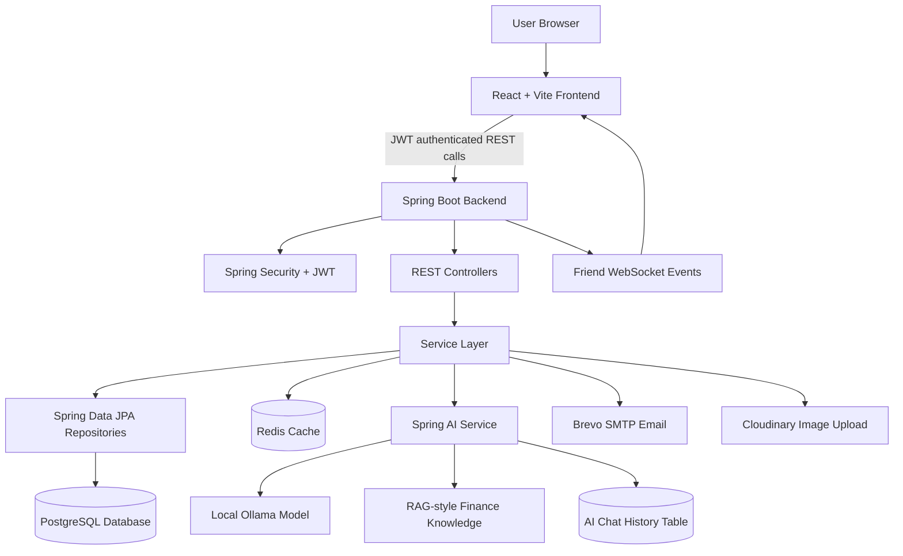
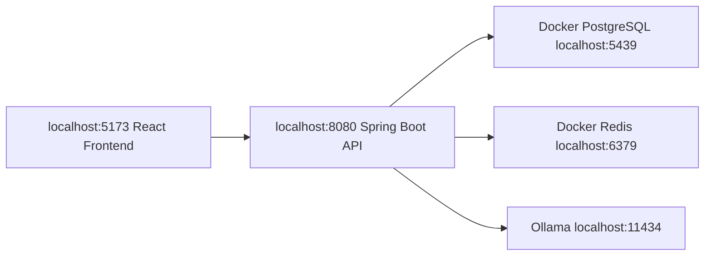
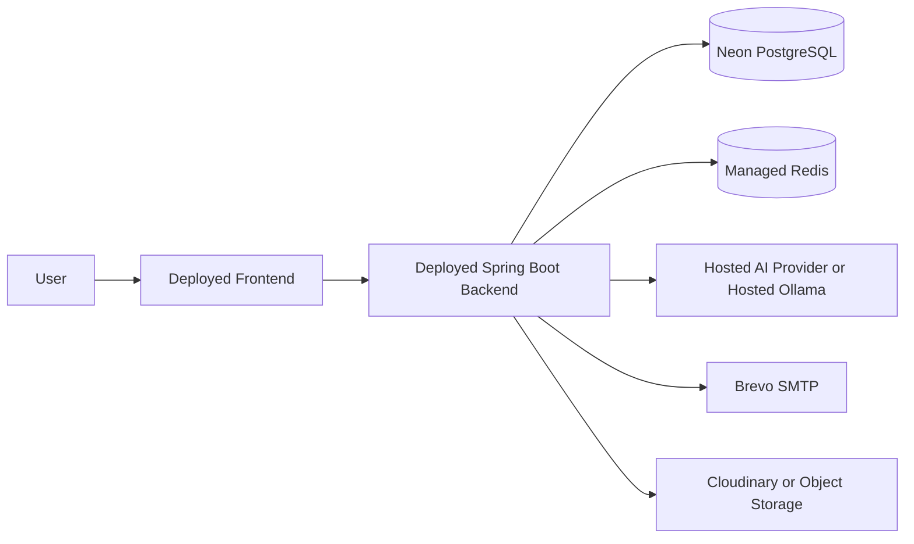

# Money Manager

Money Manager is a full-stack personal finance application built with a React frontend and a Spring Boot backend. It started as a simple CRUD app, but now includes planning, analytics, family money management, friend expense splitting, reminders, and AI-assisted financial guidance.

The goal of the system is to help a real user track where money comes from, where it goes, who spent it, what bills are due, and how shared money should be settled.

## Tech Stack

| Layer | Technology |
| --- | --- |
| Frontend | React, Vite, Tailwind CSS, Axios, React Router, Recharts, Lucide Icons |
| Backend | Spring Boot 3, Spring Security, JWT, Spring Data JPA, Spring AI |
| Database | PostgreSQL, Redis cache |
| Exports | Apache POI for Excel |
| Email | Spring Mail / Brevo SMTP configuration |
| DevOps | Docker, Docker Compose, PowerShell local run scripts |

## Project Structure

```text
Money_Manager/
+-- MoneyManager_Frontend-main/      # React/Vite frontend
+-- Money_Manager-main/
|   +-- moneymanager/                # Spring Boot backend
+-- docker-compose.yml               # PostgreSQL + Redis + backend + frontend containers
+-- run-backend-local.ps1            # Local backend runner
+-- run-frontend-local.ps1           # Local frontend runner
```

## Main Features

### Personal Finance

- User registration and login with JWT authentication.
- Profile management.
- Income and expense tracking.
- Category management for income and expense types.
- Dashboard summaries for balance, income, expenses, and recent transactions.
- Filtering by date, category, and transaction type.
- Excel export and email report support.

### Money Plan

- Monthly budgets per expense category.
- Budget progress and overspending alerts.
- Recurring income and expenses.
- Auto-create due recurring transactions.
- Savings goals with contribution history.
- Bill and subscription reminders.
- Payment method tracking: cash, UPI, card, and bank.
- Monthly comparison between current month and last month.
- Spending calendar.
- Category breakdown for "Where did my money go?" analysis.
- Cashflow forecast based on planned income, bills, recurring items, and spending.

### Family Money Manager

- Family workspace for shared household money.
- Family members such as father, mother, son, daughter, or custom roles.
- Allowances and transfers between members.
- Member-wise spending visibility.
- Shared bills and household expense tracking.
- Family dashboard to understand total family income, spending, and balances.

### Friends / Splitwise-Style Expense Sharing

- Add friends with name, email or phone, avatar, UPI ID, and status.
- Invite, accept, reject, block, or activate friends.
- Create groups for trips, roommates, family, office lunch, and other shared contexts.
- Add shared expenses with friends.
- Split expenses equally, by exact amount, by percentage, or by shares.
- Select who paid the bill.
- Automatic balance calculation: who owes you and who you owe.
- Settle up by UPI, cash, card, or bank.
- Settlement history.
- Friend reminders with due dates.
- Comments and notes on shared expenses.
- Activity timeline for friend actions, expenses, edits, reminders, and settlements.

### AI Advisor

- AI advice endpoint for financial guidance.
- AI insights card for quick spending analysis.
- Spring AI integration with local Ollama for development.
- RAG-style personal finance knowledge snippets for better budgeting guidance.
- Per-user AI chat history stored in PostgreSQL, so the advisor can reload previous messages after page changes or backend restarts.
- Recent conversation memory is included in prompts so follow-up questions have context.
- Local fallback advice when the external AI API is slow, unavailable, or quota-limited.

## Demo User

The local Docker database currently has a rich mock user for testing and interviews.

```text
Email: ujwalkuswain123@gmail.com
Password: Ujwal123
```

Mock data includes categories, income, expenses, budgets, savings goals, recurring transactions, bill reminders, family members, friends, groups, shared expenses, settlements, reminders, comments, activity history, and AI chat history.

This data is stored in the local Docker PostgreSQL volume. It will survive normal Docker restarts.

## Local Setup

### Prerequisites

- Java 21
- Maven
- Node.js and npm
- Docker Desktop for PostgreSQL and Redis
- Optional: Ollama for local AI responses

For local AI:

```powershell
ollama pull llama3.2:1b
ollama serve
```

### Environment Variables

The backend reads these values from the environment:

```text
DB_URL=jdbc:postgresql://localhost:5439/moneymanager
DB_USERNAME=postgres
DB_PASSWORD=postgres
JWT_SECRET=use-a-long-secret-value
PORT=8080
FRONTEND_URL=http://localhost:5173
BACKEND_URL=http://localhost:8080
OLLAMA_BASE_URL=http://localhost:11434
OLLAMA_MODEL=llama3.2:1b
BREVO_SMTP_LOGIN=your-smtp-login
BREVO_SMTP_KEY=your-smtp-key
BREVO_FROM_EMAIL=noreply@moneymanager.com
```

Do not commit real API keys or SMTP secrets. Keep them in local environment variables or deployment secrets.

## Run Locally

Start PostgreSQL and Redis with Docker Compose:

```powershell
docker compose up -d db redis
```

Run the backend:

```powershell
.\run-backend-local.ps1
```

Run the frontend:

```powershell
.\run-frontend-local.ps1
```

Open the app:

```text
http://localhost:5173
```

Backend API base URL:

```text
http://localhost:8080/api/v1.0
```

If the app feels slow locally, confirm the backend is using the Docker PostgreSQL database on port `5439`, not a remote production database.

## Local Data Persistence

Docker stores the local PostgreSQL database in this volume:

```text
money_manager_postgres_data
```

Safe commands that keep data:

```powershell
docker restart moneymanager-db
docker restart moneymanager-redis
docker compose stop
docker compose up -d
```

Commands that remove local database data:

```powershell
docker compose down -v
docker volume rm money_manager_postgres_data
```

Use `down -v` only when you intentionally want a clean database.

## Docker Run

To run the full stack with Docker Compose:

```powershell
docker compose up --build
```

Docker ports:

| Service | URL |
| --- | --- |
| Frontend | `http://localhost` |
| Backend | `http://localhost:8082/api/v1.0` |
| PostgreSQL | `localhost:5439` |
| Redis | `localhost:6379` |

## API Overview

Most protected endpoints require a JWT token from login.

| Area | Example Endpoints |
| --- | --- |
| Auth | `POST /register`, `POST /login`, `GET /profile` |
| Categories | `/categories`, `/categories/{type}` |
| Income | `/incomes` |
| Expenses | `/expenses` |
| Dashboard | `/dashboard` |
| Filters | `/filter` |
| AI | `/ai/advice`, `/ai/insights`, `/ai/history`, `DELETE /ai/memory` |
| Budgets | `/budgets` |
| Savings | `/savings-goals`, `/savings-goals/{goalId}/contributions` |
| Recurring | `/recurring-transactions`, `/recurring-transactions/process-due` |
| Bills | `/bill-reminders` |
| Analytics | `/analytics/monthly` |
| Money Plan | `/money-plan/summary` |
| Family | `/families`, `/families/{id}/dashboard`, `/members`, `/transfers` |
| Friends | `/friends/dashboard`, `/friends`, `/friends/groups`, `/friends/expenses`, `/friends/settlements`, `/friends/reminders` |

## Architecture Diagrams

### Full Application Architecture



### Local Development Architecture



### Production Architecture



## Backend Design

The backend follows a standard Spring Boot layered structure:

- `controller`: REST API endpoints.
- `service`: Business logic and calculations.
- `repository`: Spring Data JPA database access.
- `entity`: Database models.
- `dto`: Request and response models.
- `security`: JWT authentication filter and user details integration.
- `config`: application configuration and demo data seeding.

The backend keeps user data isolated by profile, so each logged-in user sees their own personal finance, family, and friend data.

## Frontend Design

The frontend is a React single-page application. It uses:

- Route-based pages for dashboard, categories, income, expenses, money plan, family, friends, filters, and AI advisor.
- Axios services to call the backend API.
- Token-based authenticated requests.
- Recharts for analytics charts.
- Lucide icons for modern action buttons and navigation.
- Responsive layouts for dashboard cards, planning sections, and split expense views.

## Production Notes

Before production deployment:

- Replace placeholder JWT, SMTP, database, and OpenAI values with real secrets.
- Move secrets into environment variables or platform secret storage.
- Disable development-only logging.
- Review CORS origins.
- Add database migrations with Flyway or Liquibase. Currently local development uses Hibernate `ddl-auto=update`.
- Add automated backend and frontend tests.
- Add rate limits for AI and auth endpoints.
- Use managed PostgreSQL, managed Redis, and production-grade AI hosting for production.
- Configure HTTPS and secure cookies if the auth strategy is changed.
- Store receipts or attachments in cloud storage instead of the local filesystem.

## What This Project Demonstrates

This project demonstrates how a basic CRUD finance app can be expanded into a more complete money management system:

- Personal finance tracking.
- Budget planning.
- Family money visibility.
- Friend and group expense splitting.
- AI-powered insights.
- Realistic demo data for product presentation.
- Full-stack architecture with authentication, database persistence, and API-driven UI.
